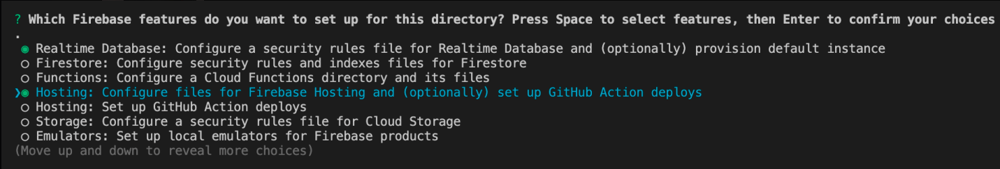

# Lab exercise to learn about Firebase
If you don't want to build a backend, you don't have to! There are so called "Backend-as-a-Service" providers that will help you out.

Of course you won't have as much possibilities as if you're rolling your own backend but for many apps, it might be enough.

Also, these services offer something else, which might be hard for you to build even if you did decide to write your own backend.

In the case of Firebase, this something else is **real time** data. Building real-time applications with sub second syncing can be quite a challenge, but with services like Firebase you have a very good starting point.

## What we'll learn

- We'll learn how to use Firebase's real time database

## Intro
If you're having an office tournament of some kind where colleges are meeting in 1 on 1 matches and the rest of the office is eagerly watching and cheering, it's often hard to keep track of who's winning.

[www.scoreplank.com](https://scoreplank.com/) is a app I threw together to make our office ping-pong tournaments more fun and engaging to watch.

It has a "Score view" which you should put on a big TV or screen close to the ping-pong table. It also has a "Judge view" which the person judging the game opens on his/her phone and can like so easily keep track of the points in the game.

The TV and the judges phone is all synced up using the real time data in Firebase.

## 0. Fork, clone and explore
Fork this repo and clone your fork.

As usual have a look at the `package.json` file and figure out how to start the app.

## 1. Create a firebase account
Go to [firebase.google.com](https://firebase.google.com/) and sign up for free.

## 2. Create a project
Go to your firebase console and Add a new project. You can leave out the analytics option.

## 3. Add basic data
Go the the "Realtime database" in your projects dashboard.

- Click "Create database"
- Choose a location in Europe if prompted
- For security rules, choose start in **test mode**
- Add some basic data using the UI you're shown. The data should look like this:

		player1:
			name: "Paulina"
			score: 12

		player2:
			name: "Yosef"
			score: 9

		sides: "default"

This is what the data should look like if you did it correctly:

## 4. Connect to your new database
Go to Settings in your firebase project and click and under General > Your apps, click the "</>" button to add a new web project.

- Pick an App nickname
- And also check the box for Firebase Hosting
- In step 2, follow the instructions to install and setup a connection to your firebase app and put that code in the `App.js` file.
- In step 4
	- Login to firebase
	- When you do an init, make sure to select these two options by pressing space before pressing enter to confirm:
		- ◉ Database: Configure Firebase Realtime Database and deploy rules
		- ◉ Hosting: Configure and deploy Firebase Hosting sites
		(NOTE: if you have a newer version of firebase, it might look like this, pick the following options:)
		
	- In the next step, select "Use an existing project" and select the name of the project you created earlier
	- Then select the following options:
		- What file should be used for Realtime Database Security Rules? database.rules.json
		- What do you want to use as your public directory? dist
		- Configure as a single-page app (rewrite all urls to /index.html)? Yes
		- Set up automatic builds and deploys with GitHub? No

## 5. Deploy!
In `App.js` after the firebase config code you pasted in, add the following:

	import { getDatabase } from "firebase/database"
	...
	const database = getDatabase(app)
	console.log(database)

Run the `npm run dev` and make sure your app still runs and that the `Database` object is logged out in the console.

First run the prod build in package json and make sure a dist folder is created in the project root.
Then run `firebase deploy` and after it's done go to [http://your-project-name.web.app](http://your-project-name.web.app) to see your app live. If it doesn't work, ask a friend for help :)

## 6. Add react-firebase-hooks
Add the [react-firebase-hooks](https://github.com/CSFrequency/react-firebase-hooks) to your app. By reading the [useObject docs](https://github.com/CSFrequency/react-firebase-hooks/tree/master/database#useobject) add a `useObject` hook to the `ScorePage` component in `App.js` and before the return statement add the `console.log(snapshot.val())` to be able to see how the snapshot looks like in the console.

If you get and error when trying to log this out, try solving that error :)

## 7. Use the data
Now you have everything to make this app real time! Start with exchanging the hard coded player names and scores in the `ScorePage` component to instead use the data from the snapshot.

Once you finish go to the "Realtime Database" item in your firebase project and in that UI, try changing the player names and their scores and see that the data is also changing in real time in your app on localhost!

Do the same thing in the judge view. That is, make sure player names and scores are read from firebase instead of being hard coded.

## 8. Write data
Follow the [Read and Write Data docs](https://firebase.google.com/docs/database/web/read-and-write#add_a_completion_callback) to understand how to use the `set` och `update` method to implement the + and - buttons in the `JudgePage` component.

If you make it right, you should now be able to open the Judge View on your phone and press + and minus and see the score change on your localhost.

When that works, also implement the "Reset scores" button.

## 9. Advanced
The last step is to implement the "Set player names" and the "Switch sides" button. No tips are given, you instead have the opportinuty to test your self-sufficiency :)

## 10. Improved work flow
Create a nicer deploy script in `package.json` that lets us deploy the app with only one command from the terminal. That command should (1) run the prod build to create a dist folder, (2) deploy to firebase and (3) remove the dist folder because it's no longer needed.

